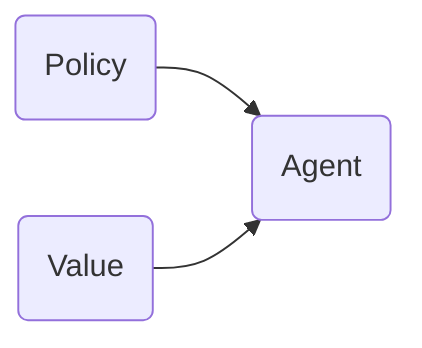

# Reinforcement Learning

This repository contains my note on RL. I don't explicitly separate deep RL from theoretical RL (bandit, MDP), since I think about them holistically.

# Introduction

RL originates from two fields:

1. trial-and-error learning in psychology.

2. optimisation in control theory.

The essence of RL is that the **agent** learns a **policy** to interact with the **environment** by observing **states**, taking **actions** and receiving **rewards** (positive or negative) through multiple interactions.

1. Agent: The instant of an algorithm, who is the entity of learning here.
2. State $s\in\mathcal S$: Anything you can observe. Also called **observation** in some literature.
3. Policy: A mapping from states to actions, which is the goal of learning. 
4. Action $a\in\mathcal A$: What the agent can do.
5. Reward $r\in\mathbb R$: A feedback the agent gets after submitting an action. 
6. Environment: This concept includes a reward function $\mathcal R:s\times a\to r$ and a transition function $\mathcal P:s\times a\to s$. **Model** is something you use to approximate an unknown environment.

Formally, an RL problem can be characterised by a Markov decision process (MDP).
$$
\mathcal M:=\langle\mathcal S,\mathcal A,\mathcal P,\mathcal R,\gamma\rangle,
$$
where $\gamma$ is a discount factor.

## Value Function

The function indicates the value of a state or a state-action pair.

**Return** at time $t$ is defined as the sum of following rewards.
$$
G_t:=\sum_{i=t}^\infty \gamma^{i-t}r_i.
$$
State-value function, the expected return with starting state $s$ under policy $\pi$.

$$
v_\pi:=E_\pi[G_t|S_t=s].
$$

Action-value function, the expected return with starting state $s$ and action $a$ under policy $\pi$.

$$
q_\pi(s,a):=E[G_t|S_t=s, A_t=a].
$$

They satisfy **Bellman equation**, which connects them.

State-value function can be decomposed as immediate reward and the discounted reward in the time to come.

And you can do the same to action-value function.

$$
q_\pi(s,a)=\sum_{s',r}p(s',r|s,a)[r+\gamma v_\pi(s')].\\
\ \\
v_\pi(s)=\sum_a\pi(a|s)q_\pi(s,a).
$$

# Algorithm Taxonomy

value-based: learn a value approximation function and gain a policy indirectly

policy-directly: just output a policy

policy+value: value to evaluate policy, actor-critic

model: how environment reacts to your action. Like transition probability.

whether to learn a model: I thought model-free is more robust.

A useful diagram can be found [here](https://spinningup.openai.com/en/latest/spinningup/rl_intro2.html).

update frequency: round(one set game ends with win or lose) or single-step

off-policy: you can learn from other's experience, versus on-policy (sample policy is the same as decision policy)
