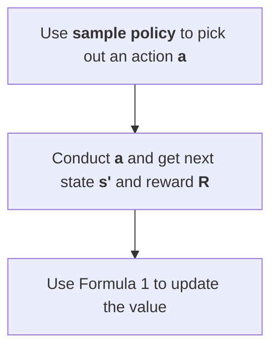

# Brief

DQN uses a neural network to approximate state values instead of a Q-table. In Q-learning, the agent's brain is the Q-table, but in DQN, the agent's brain is a deep neural network. The input to the neural network is the state or observation, and the number of output neurons is the number of actions the agent can take.

# Optimisation

## Double Learning
Note that I think this is a optimisation for the whole Q-learning framework instead of being specific to DQN.

Note that in the core formula of Policy Evaluation we use $\max$ to be the value of the next state.

So once we sampled an uncommon high result. This won

# Q-learning framework

Hyperparameters

1. $\alpha$ learning rate.

2. $\gamma$ decay: the weight determining how important the future expectation is. When we evaluate a state which is $k$ time steps from now, its value will be multiplied by $\gamma^k$.

---

Formulae

- $$Q(s,a) += \alpha(R+\gamma\max_{a'}(Q(s',a'))-Q(s,a)).\tag{1}$$

---

Method

Policy Evaluation

For a single iteration

