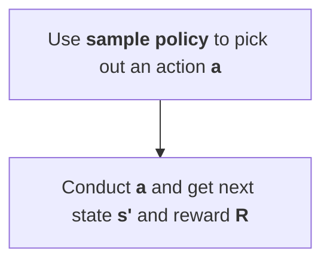

# Brief

DQN uses a neural network to approximate state values instead of a Q-table. In Q-learning, the agent's brain is the Q-table, but in DQN, the agent's brain is a deep neural network. The input to the neural network is the state or observation, and the number of output neurons is the number of actions the agent can take.

# Optimisation

## Double Learning
Note that I think this is a optimisation for the whole Q-learning framework instead of being specific to DQN.

For a single iteration

