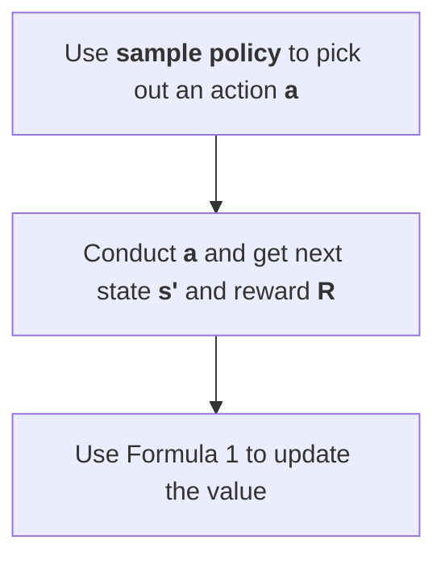

# Q-learning

## Setting

**Hyper-parameters**

1. $\alpha$ learning rate.

2. $\gamma$ decay: the weight determining how important the future expectation is. When we evaluate a state which is $k$ time steps from now, its value will be multiplied by $\gamma^k$.

---

**Formulae**

$$
Q(s,a) += \alpha\cdot\left(\underbrace{R+\gamma\max_{a'}(Q(s',a')}_\text{target})-Q(s,a)\right).\tag{1}
$$

You may notice that the **target** is also derived from the current Q-values (tables in this case, or networks in DQN). This creates a problem because updating the Q-values affects both the target and the value, making the learning process unstable. To address this issue, a technique called the **target network** can be used, which we will discuss later.

## Steps

Policy Evaluation

For a single iteration

# Double Learning

## Usage

This is an optimisation designed to tackle the overestimation issue inherent in Q-learning.

The formula below represents the ground truth that we aim to approximate:

$$
V(s):=\max_{s\to s'}V(s').
$$

However, during our approximation process, $V_t(s)$ is a random variable with $E[V_t(s)]=V(s)$.

Therefore, Q-learning tends to produce higher estimates because $E[\max(a,b)]>\max(E[a],E[b])$.

# Replay Buffer

Reuse training tuples during training, which destroys the order of sampling; thus reduces the correlation between samples.

And we can do $K$ times of sample and update then go back to getting data. $K=1$ is common but larger $K$ is more efficient.

# Target Network

I am not particularly fond of this name. I believe it should be called **delayed target update**, as the core idea is to differentiate the target and the value by synchronizing them **after a delay**.

The updating process now works as follows:

Target Q value $Q_T$ and Q value $Q$.

**for** a while (delay time):
$$
Q(s,a) += \alpha\cdot\left(\underbrace{R+\gamma\max_{a'}(Q_T(s',a')}_\text{target})-Q(s,a)\right).
$$

update target Q value: $Q_T\leftarrow Q$.
